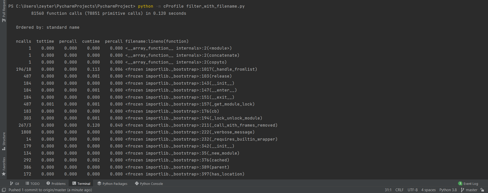
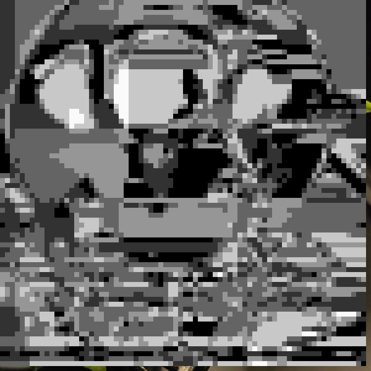

# PyCharm-task-10
<h2>Время выполнения файлов (создание мозаики)</h2>

Время выполнения файла <code>filter.py</code>
  

Время выполнения файла <code>old_filter.py</code>
  

Время выполнения файлов очень сильно отличается из-за того, что в новой версии алгоритма 
большая часть времени уходит на ввод данных пользователем вручную.

Время выполнения файла <code>filter_with_filename.py</code>
  

